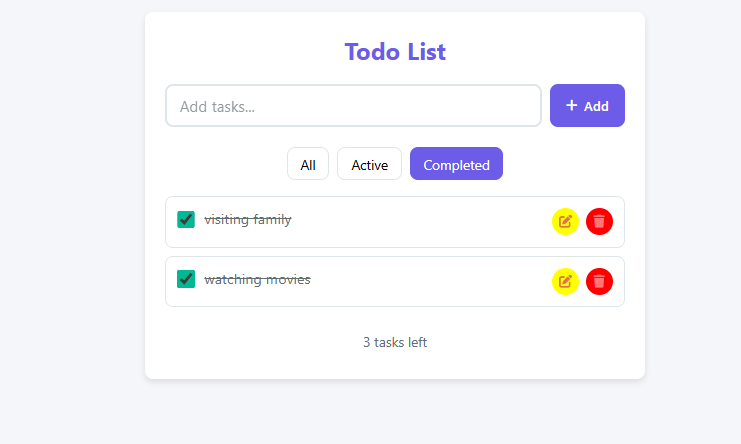

# Todo List Application

A simple, responsive Todo List application built with React and TypeScript, featuring persistent storage using localStorage.

## Features
- Add new tasks  
- Edit existing tasks  
- Mark tasks as complete/incomplete  
- Delete tasks  
- Persistent storage using localStorage  
- Clean and modern UI  
- Fully responsive design  
- Keyboard-friendly operations  

## Technologies Used
- React 18  
- TypeScript  
- CSS Modules for styling  
- Font Awesome for icons  
- localStorage for data persistence  




## How to Run

1. Clone this repository or download the files

2. Open the `index.html` file in your web browser
3. No server or additional dependencies required

## Usage Guide

Adding Tasks
-Type your task in the input field
-Press Enter or click the "+ Add" button

Managing Tasks
-Complete: Click the checkbox
-Edit: Click the edit (pencil) button
-Delete: Click the delete (trash) button

Filtering Tasks
-All: Shows all tasks (default)
-Active: Shows only incomplete tasks
-Completed: Shows only finished tasks

## Project Structure

```
todo-list/
├── index.html          # Main HTML file
├── style.css           # CSS styles
├── script.js           # JavaScript functionality
├── README.md           # Project documentation
└── Screenshots/        # Screenshots
    ├── screenshot-1.png
    └── screenshot-2.png
```
