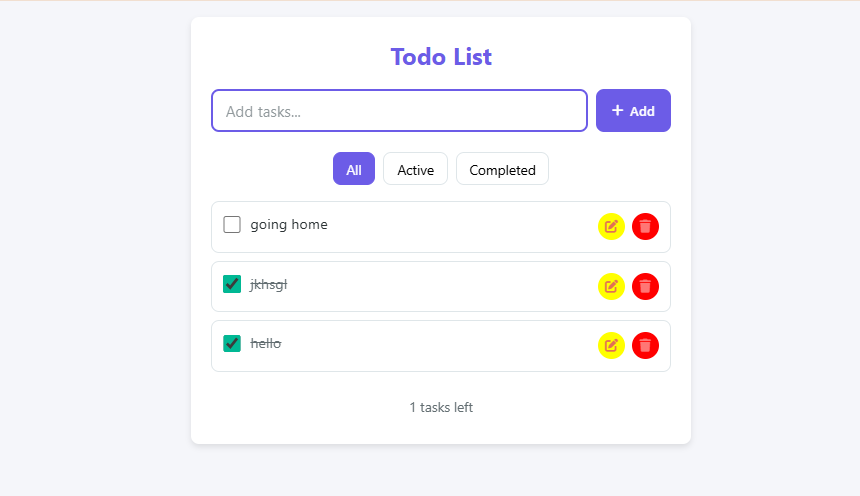

# Todo List Application

A simple, responsive todo list application with persistent storage using localStorage.

## Features

- Add new tasks
- Mark tasks as complete/incomplete
- Edit existing tasks
- Delete tasks
- Filter tasks (All/Active/Completed)
- Persistent storage using localStorage
- Clean and modern UI
- Fully responsive design
- Task counter

## Technologies Used

- HTML5
- CSS3
- JavaScript (ES6)
- Font Awesome for icons
- localStorage for data persistence





## How to Run

1. Clone this repository or download the files 

2. Open the `index.html` file in your web browser
3. No server or additional dependencies required

Usage Guide 📝
Adding Tasks
Type your task in the input field

Press Enter or click the "+ Add" button

Managing Tasks
✔️ Complete: Click the checkbox

✏️ Edit: Click the edit (pencil) button

🗑️ Delete: Click the delete (trash) button

Filtering Tasks
All: Shows all tasks (default)

Active: Shows only incomplete tasks

Completed: Shows only finished tasks

## Project Structure

```
todo-list/
├── index.html          # Main HTML file
├── style.css           # CSS styles
├── script.js           # JavaScript functionality
├── README.md           # Project documentation
└── Screenshots/        # Screenshots
    ├── screenshot-1.png
    └── screenshot-2.png
```
